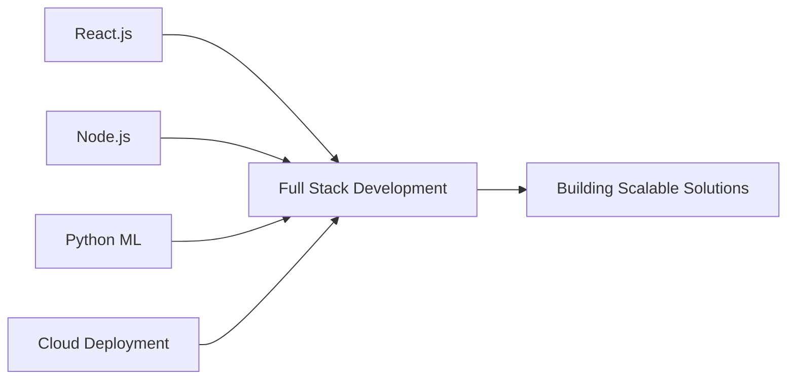

<div align="center">
  
  
  
  <h3>Full Stack Developer | AI/ML Engineer | Freelancer</h3>
  
  <p>
    
  </p>
  
  <p>
    
    
    
  </p>
  
</div>

---

## About Me

```python
class Developer:
    def __init__(self):
        self.name = "Muhammad Imran"
        self.role = "Full Stack Developer & AI/ML Engineer"
        self.experience = "4+ Years"
        self.location = "Pakistan"
        self.availability = "Open for Freelance"
        self.contact = "+92 3703027584"
        self.email = "muhammadimran27584@gmail.com"
    
    def current_focus(self):
        return ["React.js", "Node.js", "Python ML", "PHP", "MySQL"]
    
    def goals(self):
        return "Build innovative solutions that solve real-world problems"
```

---

## Tech Stack

<div align="center">

### Frontend Development


### Backend Development


### AI & Data Science


### Tools & Platforms


</div>

---

## GitHub Analytics

<div align="center">
  
| Metric | Stats |
|--------|-------|
| **Commits** |  |
| **Open Source** |  |
| **Freelance** |  |

</div>

<div align="center">
  
  
</div>

<div align="center">
  
</div>

<div align="center">
  
</div>

---

## Featured Projects

<div align="center">

| Project | Tech Stack | Description |
|---------|------------|-------------|
| **Language Detection System** | Python, Streamlit, scikit-learn | AI-powered language detection with 92% accuracy |
| **Movie Recommender System** | Python, Pandas, Cosine Similarity | Netflix-style content-based filtering |
| **E-Commerce Platform** | React, PHP, MySQL | Full-stack online store with payment integration |
| **Portfolio Website** | HTML5, CSS3, JavaScript | Modern responsive portfolio design |

</div>

---

## Current Focus



<div align="center">

| Priority | Technology | Status |
|----------|------------|--------|
| 1 | React.js & Modern Frontend | Actively Learning |
| 2 | Node.js & REST APIs | Building Projects |
| 3 | Python Machine Learning | Creating AI Apps |
| 4 | Cloud Deployment (AWS/Vercel) | Exploring |
| 5 | System Architecture Design | Implementing |

</div>

---

## Connect With Me

<div align="center">
  
  <a href="https://www.linkedin.com/in/muhammad-imran-5a9083250">
    
  </a>
  <a href="https://www.instagram.com/codebyimran">
    
  </a>
  <a href="https://www.tiktok.com/@codebyimran">
    
  </a>
  <a href="https://www.facebook.com/share/1EakBCSgxL/">
    
  </a>
  <a href="https://wa.me/923703027584">
    
  </a>
  <a href="mailto:muhammadimran27584@gmail.com">
    
  </a>
  <a href="https://github.com/codebyimran">
    
  </a>
  
</div>

---

## Weekly Coding Activity

<div align="center">
  
```text
React.js      █████████░░░░░░░░  45%
Python        ████████░░░░░░░░░  35%
Node.js       ██████░░░░░░░░░░░  25%
PHP           █████░░░░░░░░░░░░  20%
Data Science  ████░░░░░░░░░░░░░  15%
```

</div>

---

## Recent Activity

<!--RECENT_ACTIVITY:start-->
- 🚀 Built Language Detection AI System with 92% accuracy
- 💻 Created Netflix-style Movie Recommender
- 📱 Developed responsive e-commerce platform
- 🔧 Learning Node.js and Express.js
- 🤝 Open for freelance collaborations
<!--RECENT_ACTIVITY:end-->

---

<div align="center">
  
  
  
  <h3>Let's Build Something Amazing Together</h3>
  
  <p>
    
    
    
  </p>
  
  <p>
    <i>Code with purpose. Build with passion. Deliver with excellence.</i>
  </p>
  
  <p>
    <b>© 2024 Muhammad Imran (codebyimran)</b>
  </p>
  
</div>
```
